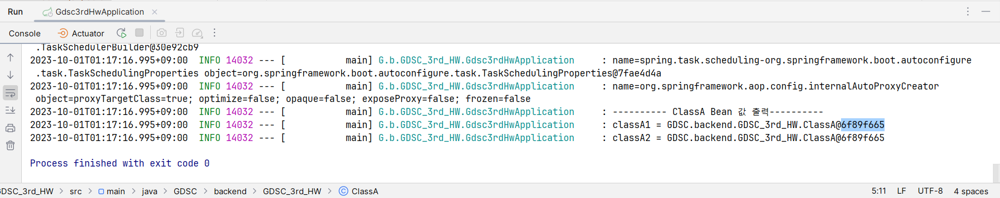

# 1. Spring Bean이란 무엇인가?
- Spring IoC Container에 의해 관리되는 자바 객체
	- Spring IoC Container: 빈을 관리하는 객체

# 2. Spring Bean을 등록하는 방법을 정리하라
- Config 파일에 class를 선언 및 생성하여 @Bean 어노테이션을 class 위에 붙인다.
- @Component, @ComponentScan 어노테이션을 이용한다.
	- @Component: 빈으로 등록
	- @ComponentScan: 스프링이 검색할 패키지 범위 설정 
	- @Configuration, @Service, @Controller, @Repository

# 3rd_HW 결과
