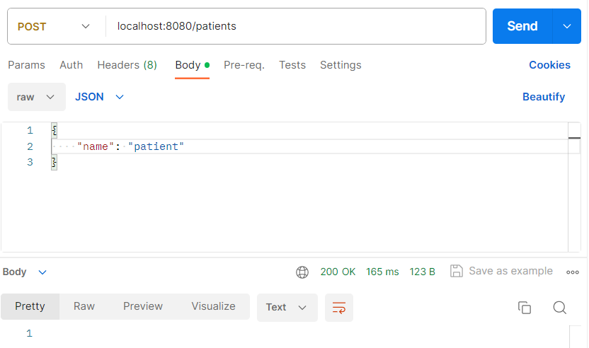
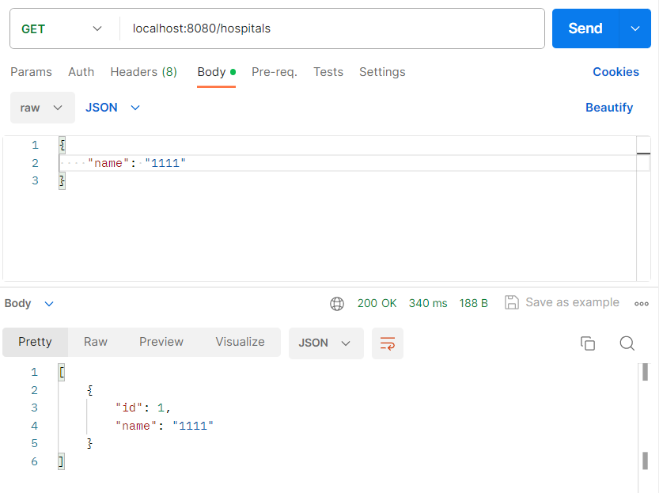
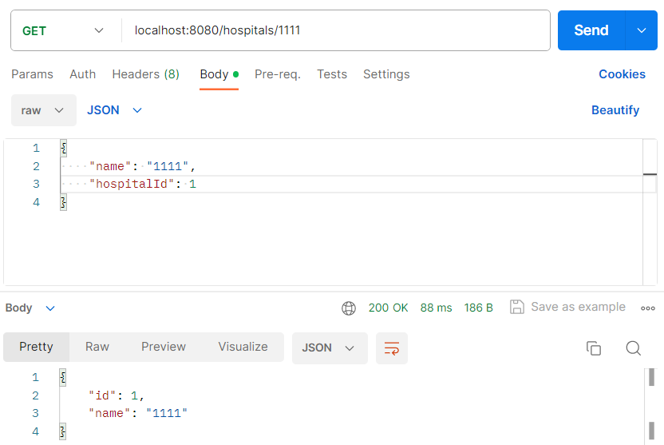
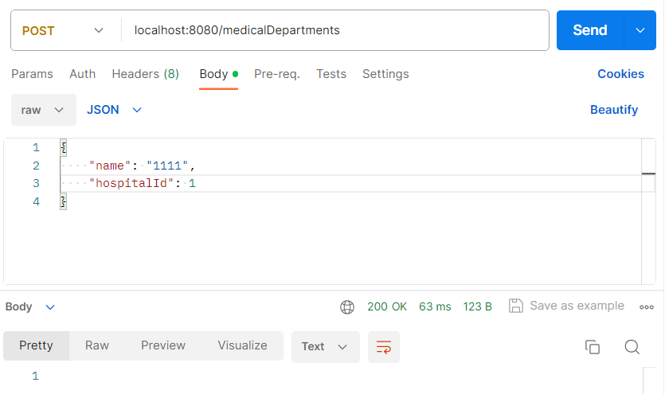
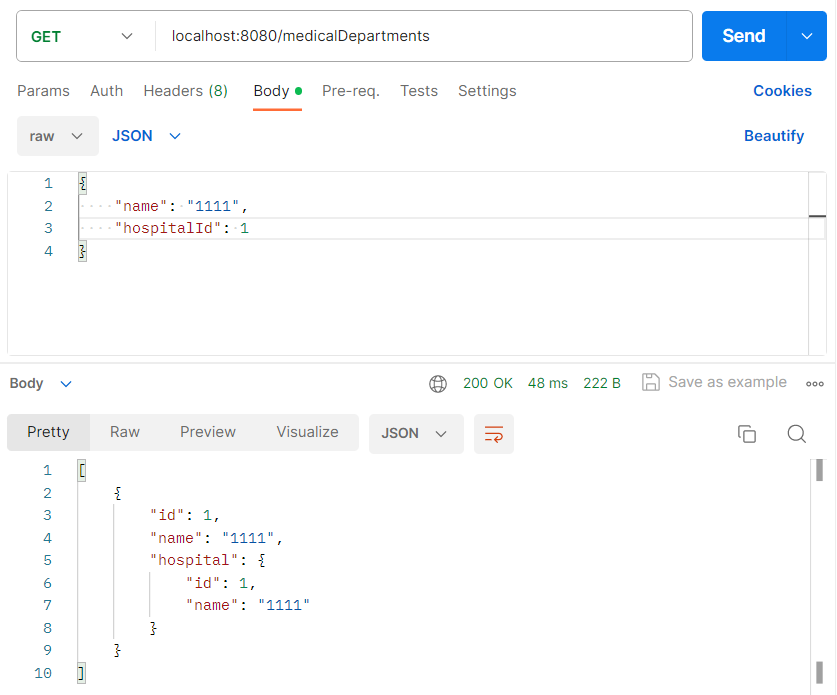
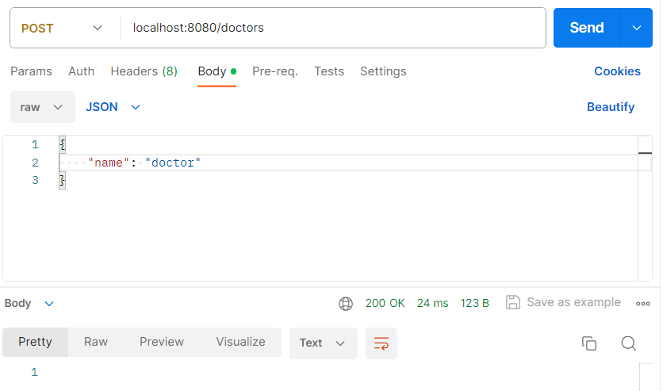
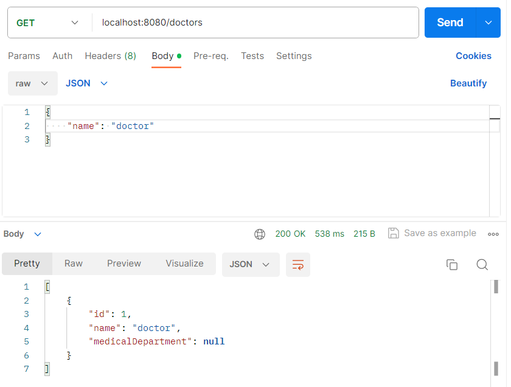
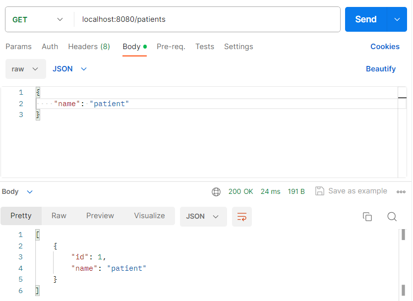
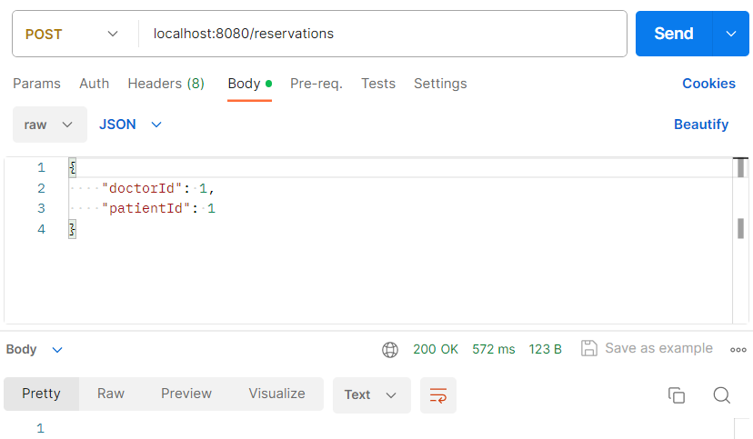
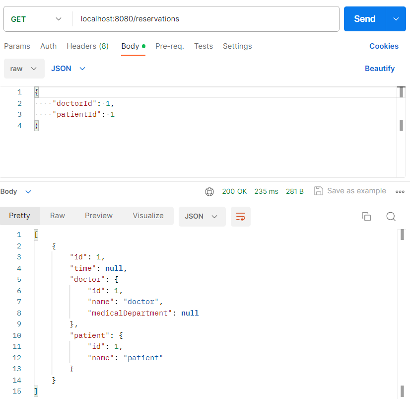

- POST /hospitals
    ```
    {
        "name": "1111"
    }
    ```
    

- GET /hospitals
    

- GET /hospitals/{name}
    

- POST /medicalHospitals
    ```
    {
        "name": "1111",
        "hospitalId": 1
    }
    ```
    

- GET /medicalHospitals
    

- POST /doctors
    ```
    {
        "name": "doctor"
    }
    ```
    

- GET /doctors
    

- POST /patients
    ```
    {
        "name": "patient"
    }
    ```
    

- GET /patients
    

- POST /reservations
    ```
    {
        "doctorId": 1,
        "patientId": 1
    }
    ```
    

- GET /reservations
    